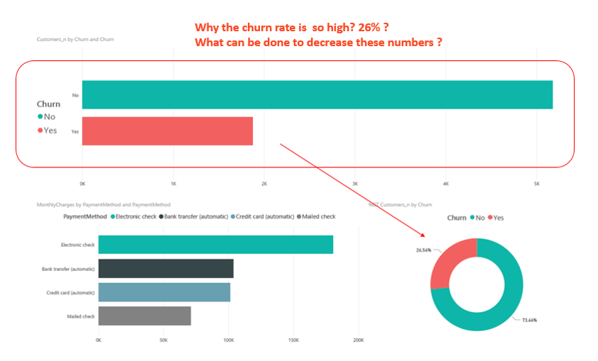
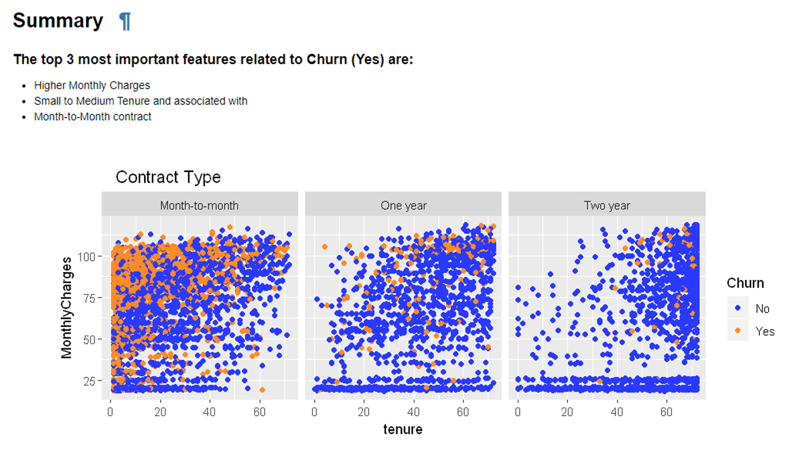
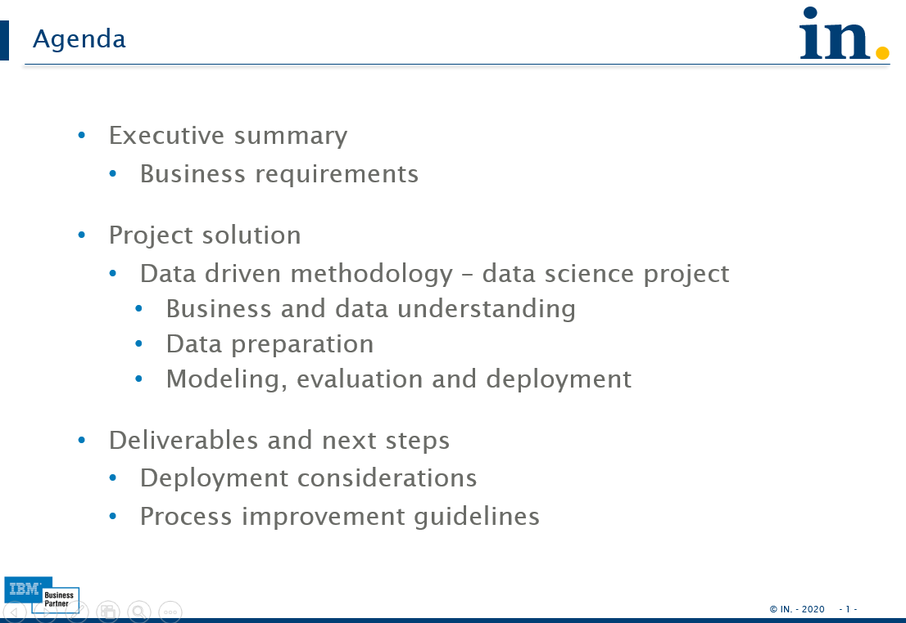

# Customer support

This data science project will show how to move from one initial business requirement to the root causes of customer churn
  (sample information/dataset provided by IBM)

### Business requirement

##### Summary and root causes identified

##### Info 
All docs, notebooks and code are available at bin/ and doc/ directories
  Below one resume related to the project solution

