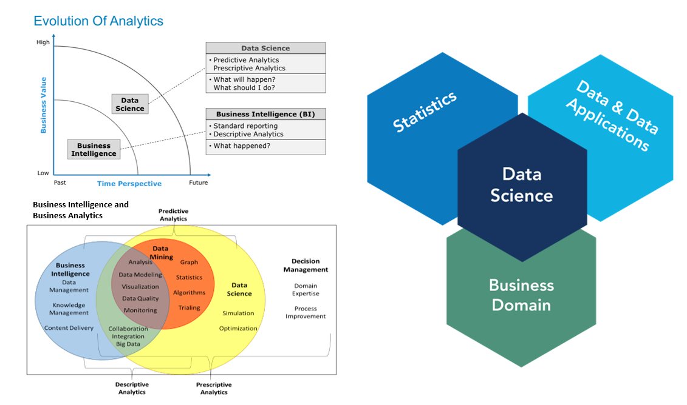
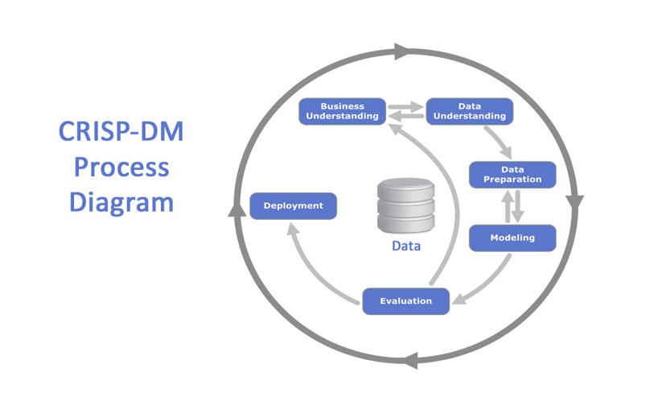

# DataScience_projects

The goal of this repo is to showcase the evolution from Business Intelligence to Advanced Analytics, including data science and machine learning projects—such as customer churn and marketing campaign analysis—guided by the CRISP-DM methodology.

The repository also explores the evolution of how these solutions are built, comparing **traditional hand-coded approaches with agentic workflows using coding agents** to design, implement, and deliver these solutions.

### Enterprise Intelligence and Analytics

The graph below shows a brief summary of knowledge areas, concepts and processes highly correlated between BI, Analytics and Data Science along with Decision Management.



#### CRISP-DM methodology — main phases



---

## Coding Agents for Data Science

The newest step in the evolution of analytics is **agent-assisted data science**: using AI coding agents to accelerate the CRISP-DM cycle — from data understanding to model deployment — while the analyst stays in control of the business questions and validates every result.

**AI agents are moving beyond code — engineering software, analyzing data, building ML models, and acting as research and knowledge assistants -  [`Research_guidelines/`](./customer_churn_coding_agents/Research_guidelines/).**

The example below runs **the same business problem (customer churn) on the same dataset three times**, hand coded vs agentic code (local vs Lakehouse):

| # | Track | Tooling | Where |
|---|---|---|---|
| 1 | **Hand-coded, classic** | Python / R notebooks, XGBoost, LightGBM, H2O, Spark ML | [`Customer_Support/`](./Customer_Support/) |
| 2 | **Agent on the lakehouse** | Databricks Data Science Agent + Genie, Unity Catalog, MLflow | [`customer_churn_coding_agents/databricks_notebooks/`](./customer_churn_coding_agents/databricks_notebooks/) |
| 3 | **Agent (claude cowork - local agent)** | Local coding agent (Claude Code) + `uv` (python package manager)  + scikit-learn | [`customer_churn_coding_agents/local_coding_agent/`](./customer_churn_coding_agents/local_coding_agent/) |

**The dataset — Telco Customer Churn (IBM sample):** 7,043 customers × 21 columns, binary target `Churn` (Yes/No), overall churn rate **26.54%** (1,869 churners), class imbalance **2.77 : 1**.
Source file: [`customer_churn_coding_agents/data/`](./customer_churn_coding_agents/data/)

> Why churn and not a toy dataset? Churn is a *moderately* imbalanced, cost-asymmetric problem — a missed churner costs a customer, a false alarm costs a discount coupon. That asymmetry is what makes metric selection a business decision rather than a technical one, and it is where agents most need a human in the loop.

---

### How the agent maps to CRISP-DM

| CRISP-DM phase | Agent-driven work | What the agent produced |
|---|---|---|
| **Business Understanding** | Frame churn as binary classification, choose the metric | Recall/ROC-AUC prioritised over accuracy; 26.5% base rate makes accuracy misleading |
| **Data Understanding** | Bronze table from the Unity Catalog volume or local file analysis, then comprehensive EDA | `customer_churn_bronze` (7,043 × 21); 11 missing `TotalCharges` typed as string, tenure↔churn **−0.35**, onboarding crisis at 0–3 months |
| **Data Preparation** | Silver table or local file + feature engineering | 28+ engineered features in 5 families (tenure, spending, service bundles, risk flags, binary encodings) |
| **Modeling** | Trained & compared 5 algorithms, then tuned the winner (RandomizedSearchCV, 5-fold) | LogReg, Random Forest, Gradient Boosting, XGBoost, LightGBM — all logged to MLflow; tuning **did not** beat the baseline on ROC-AUC, it traded precision for recall |
| **Evaluation** | Confusion matrix, classification report, ROC & precision–recall curves, feature importance, SHAP | Per-class precision/recall/F1 and side-by-side model ranking; contract terms and tenure dominate, demographics near-irrelevant (~1.4%) |
| **Deployment** | Model selection for production + business recommendations & rollout plan | **XGBoost** selected on the ROC-AUC/recall combination; risk-tiered retention campaigns, weekly batch scoring, drift monitoring, A/B test |

---

### Prompts used to drive the agents

The whole workflow was produced through a short sequence of natural-language prompts — each one is checked in, so the run is reproducible:

| Prompt | Purpose |
|---|---|
| [`z01_prompt_databricks_genie_bronze_table.md`](./customer_churn_coding_agents/prompts/z01_prompt_databricks_genie_bronze_table.md) | *"Read the file at volume `vol_demo.dw_raw.customer_churn` and create bronze and silver tables… then build a pipeline with these notebooks and run it, fixing any error."* |
| [`z02_EDA__customer_churn__and_machine_learning_proposal.md`](./customer_churn_coding_agents/prompts/z02_EDA__customer_churn__and_machine_learning_proposal.md) | *"Perform comprehensive EDA… think like a data scientist and provide insights."* + *"Which machine learning use cases would you recommend with this data?"* |
| [`z03_feature_engineering__machine_learning.md`](./customer_churn_coding_agents/prompts/z03_feature_engineering__machine_learning.md) | *"Identify which features most influence churn… create a silver table and build new features… baseline Random Forest with feature importance and Gini index."* |
| [`z04_model_training_and_Evaluation.md`](./customer_churn_coding_agents/prompts/z04_model_training_and_Evaluation.md) | *"Train multiple models and compare algorithms… perform hyperparameter tuning… analyse feature importance, SHAP and explain what it means for the business."* |
| [`z05_local_coding_agent_full_pipeline.md`](./customer_churn_coding_agents/prompts/z05_local_coding_agent_full_pipeline.md) | The same CRISP-DM brief, handed to a **local** coding agent instead of the lakehouse agent |
| [`z06_local_coding_agent_readme_request.md`](./customer_churn_coding_agents/prompts/z06_local_coding_agent_readme_request.md) | *"Create a README from the notebook result… explain the difference between ROC-AUC, Recall and F1, which model is selected and how to deploy it."* |

Note the shape of these prompts: they state the **business question and the artifact to produce**, not the code. The agent picks the libraries; the analyst picks the metric.

---

### Track 2 — Databricks Data Science Agent (medallion architecture - without gold layer)

Notebooks in [`customer_churn_coding_agents/databricks_notebooks/`](./customer_churn_coding_agents/databricks_notebooks/):

| Notebook | Phase | Output |
|---|---|---|
| [`00_Bronze_Table_Creation.ipynb`](./customer_churn_coding_agents/databricks_notebooks/00_Bronze_Table_Creation.ipynb) | Data Understanding | `crm.customer_info.customer_churn_bronze` — 7,043 rows, all columns as string |
| [`01_EDA_Baseline_Model_feature_importance.ipynb`](./customer_churn_coding_agents/databricks_notebooks/01_EDA_Baseline_Model_feature_importance.ipynb) | Data Understanding → Modeling | Missing values, distributions, churn cross-tabs, correlation heatmaps, anomalies — then a raw-feature Random Forest baseline + Gini importance and the ML use-case proposal |
| [`02_silver_table_FE_and_ML_baseline.ipynb`](./customer_churn_coding_agents/databricks_notebooks/02_silver_table_FE_and_ML_baseline.ipynb) | Data Preparation | `crm.customer_info.customer_churn_silver` — 28+ engineered features, RF baseline |
| [`03_machine_learning_and_model_evaluation.ipynb`](./customer_churn_coding_agents/databricks_notebooks/03_machine_learning_and_model_evaluation.ipynb) | Modeling → Evaluation | 5-model comparison, tuning, SHAP, business recommendations |

Full annotated agent transcript: [`databricks_notebooks/README.md`](./customer_churn_coding_agents/databricks_notebooks/README.md)

#### What the EDA found

| Signal | Finding |
|---|---|
| **Onboarding crisis** | **56.2% churn in the first 3 months** (1,062 customers) — 2× the base rate |
| **Contract type** | Month-to-month: **42.7% churn** (3,875 customers) |
| **Service quality** | Fiber optic: **41.9% churn** (3,096 customers) |
| **Payment friction** | Electronic check: **45.3% churn** (2,365 customers) |
| **Tenure** | Churners average **18.0 months** vs. 37.6 for retained customers (−52%) |
| **Price sensitivity** | Churners pay **21.5% more** per month ($74.44 vs. $61.27) |
| **Revenue at risk** | **$1.67M annual recurring revenue**, ~$139K/month; avg. customer lifetime value $2,280 |
| **Data quality** | 11 missing `TotalCharges`; `TotalCharges` stored as string; 2,602 records (37%) with billing-total mismatches |

#### Model comparison (held-out 20% test set, silver features)

| Model | ROC-AUC | Recall (churn) | Precision (churn) | F1 (churn) | Accuracy |
|---|---|---|---|---|---|
| **Logistic Regression** ✅ | **0.8642** | 0.4638 | 0.7033 | 0.5590 | 0.8062 |
| Gradient Boosting | 0.8636 | 0.5684 | 0.6883 | 0.6226 | 0.8176 |
| LightGBM | 0.8557 | 0.5550 | 0.6765 | 0.6097 | 0.8119 |
| Random Forest | 0.8491 | 0.4853 | 0.6679 | 0.5621 | 0.7999 |
| XGBoost | 0.8438 | 0.5174 | 0.6370 | 0.5710 | 0.7942 |

Tuning the winner (`RandomizedSearchCV`, 5-fold stratified, scoring ROC-AUC → best params `C=1`, `penalty=l2`, `solver=liblinear`):

| Metric | Baseline | Tuned | Δ |
|---|---|---|---|
| ROC-AUC | 0.8642 | 0.8637 | **−0.0005** |
| Recall | 0.4638 | 0.5255 | +0.0617 |
| F1 | 0.5590 | 0.5921 | +0.0331 |
| Accuracy | 0.8062 | 0.8084 | +0.0022 |

**Read this table carefully.** Tuning did *not* improve the model's ability to rank customers by risk — it moved the operating point. That is a real result, and the agent reported it rather than hiding it.

---

### Track 3 — Local coding agent (single reproducible notebook)

[`local_coding_agent/customer_churn_analysis.ipynb`](./customer_churn_coding_agents/local_coding_agent/customer_churn_analysis.ipynb) — the whole CRISP-DM cycle in one executed notebook, `uv`-managed, no cloud dependency. Write-up: [`local_coding_agent/README.md`](./customer_churn_coding_agents/local_coding_agent/README.md).

| Model | ROC-AUC | Recall (churn) | Precision (churn) | F1 (churn) | Accuracy |
|---|---|---|---|---|---|
| **Gradient Boosting** ✅ (Agent) | **0.843** | 0.51 | 0.67 | 0.58 | 0.80 |
| Logistic Regression | 0.842 | 0.78 | 0.50 | 0.61 | 0.74 |
| **XGBoost**  ✅ (Data Scientist) | 0.841 | 0.78 | 0.53 | 0.63 | 0.75 |
| LightGBM | 0.839 | 0.77 | 0.52 | 0.62 | 0.75 |
| Random Forest | 0.822 | 0.64 | 0.55 | 0.59 | 0.77 |

Here too, tuning moved ROC-AUC only from 0.8426 → 0.8459. **Two independent agents, two toolchains, the same ceiling of ~0.84–0.86 ROC-AUC** — strong evidence that the ceiling is in the data, not in the modelling effort. Knowing when to stop tuning and start engineering better features is still a human call.

---

### The production choice — XGBoost (local agent execution)

**Decision: deploy the XGBoost model from the local agent run (Track 3).**

Every candidate ranks customers by risk about equally well — the top four sit within **0.004 ROC-AUC** of one another, indistinguishable on a single split of the data. When ranking quality ties, the deciding question becomes a business one: *how many of the customers who actually leave does the model catch?*

| | Best-ranked model | **XGBoost — selected** |
|---|---|---|
| **Churners caught** (recall) | 51% | **78%** |
| Ranking quality (ROC-AUC) | 0.843 | 0.841 |
| Catch vs. false alarms (F1) | 0.58 | **0.63** |

**In business terms:** for the same ranking quality, XGBoost surfaces roughly **three of every four** customers about to leave, against **one in two** for the alternative. Against $1.67M of annual revenue at risk, the churners it finds are worth considerably more than the discount offers wasted on the extra false alarms it raises.

**One qualification.** The lakehouse run (Track 2) ranks XGBoost last. That run is not a like-for-like comparison — it scored *every* model with imbalance correction switched off and an inflated feature set — so the decision rests on the local run, which was configured correctly. Two checks close this out before go-live:

1. **Re-run the lakehouse comparison on equal terms** — it either confirms the choice or overturns it.
2. **Tune the alert threshold to the retention team's capacity**, so the extra churners found become calls actually made.

*(Technical detail behind both points is in [Caveats a reviewer should catch](#caveats-a-reviewer-should-catch). ✅ in the tables above marks the best ROC-AUC within each run.)*

---

### Which metric, and why

Churn is imbalanced, so **accuracy is the wrong headline number** — predicting "nobody churns" scores 73.5% accuracy and saves zero customers.

| Metric | Question it answers | Use it to |
|---|---|---|
| **ROC-AUC** | How well does the model *rank* customers by risk? | Compare and select models (threshold-independent) |
| **Recall** | Of the customers who actually churned, how many did we catch? | Size the retention campaign — a missed churner is a lost customer |
| **Precision** | Of the customers we flagged, how many really churn? | Control the cost of wasted offers |
| **F1** | Balance between the two | Summarise when both error types carry real cost |

> **Rule of thumb:** use **ROC-AUC to pick the model**, then **tune the decision threshold** on the precision–recall curve against how many customers the retention team can actually contact. The default 0.5 is a library default, not a business decision.

---

### From prediction to action

The model is the cheap part. What the business does with the score is the project:

1. **Fix onboarding first.** 56% churn in the first 90 days is a process defect, not a prediction problem — no model recovers a customer who leaves before the first scoring run.
2. **Score weekly, act on the top decile**, ranked by `MonthlyCharges` so outreach is sized by revenue at risk.
3. **Convert month-to-month to annual.** The single largest controllable lever — 3,875 customers at 42.7% churn.
4. **Investigate fiber-optic service quality.** A 41.9% churn rate on a premium product is an operations signal, not a pricing one.
5. **A/B test the interventions.** An accurate model that changes nobody's behaviour has an ROI of zero.

---

### Key takeaways

- **Speed with rigor** — the agents handled the boilerplate (EDA, plotting, encoding, model comparison, SHAP) so the analyst could focus on framing the problem and validating results.
- **Human-in-the-loop is not optional.** The agents self-corrected genuine bugs mid-run (`.cache()` unsupported on serverless, string/numeric comparison in the missing-value scan, categorical columns leaking into the feature matrix), and they reported honestly when tuning underperformed. They also produced mistakes a reviewer had to catch — see the caveats below.
- **The metric is a business decision.** Every agent will happily optimise accuracy if you let it. Choosing recall-first for churn is a judgement about the cost of a lost customer.
- **CRISP-DM still applies.** Coding agents compress the phases; they do not replace the methodology or the domain judgement behind it.

#### Caveats a reviewer should catch

Published deliberately, because "what the agent got wrong on Lakehouse" is the most useful part of an agent case study:

- **`customerID` was one-hot encoded** in `03_machine_learning_and_model_evaluation.ipynb`, inflating the feature matrix to 7,105 columns of near-pure noise. The tree models absorbed it, but the identifier should have been dropped before encoding.
- **`Risk_Score` dominates the silver-table feature importance (15.6%) partly by construction** — it is a weighted composite of the month-to-month, electronic-check and fiber-optic flags. It confirms the EDA rather than discovering anything new; the raw-feature model in `01_EDA_Baseline_Model_feature_importance` gives the more interpretable ranking (tenure 0.233, MonthlyCharges 0.159, Contract 0.142).
- **The tuning run logged "classes are balanced"** at a 2.77:1 ratio and skipped `scale_pos_weight`. Defensible at this ratio, but it should be a stated decision, not a silent branch.
- **Random splits, not out-of-time splits.** Production churn models need a temporal holdout; this comparison does not have one.

---

## Repository map

```
DataScience_projects/
├── README.md                             # you are here
├── img/                                  # diagrams used above
│
├── Customer_Support/                     # Track 1 — classic hand-coded CRISP-DM
│   ├── bin/                              #   Phase 0–3 notebooks (Python, R, H2O, Spark)
│   ├── data/                             #   Telco churn CSV
│   └── doc/                              #   business requirement + solution deck
│
└── customer_churn_coding_agents/         # Tracks 2 & 3 — agent-assisted
    ├── README.md                         #   entry point for both agent tracks
    ├── data/                             #   Telco churn CSV (same source data)
    ├── prompts/                          #   every prompt used to drive the agents
    ├── databricks_notebooks/             #   Track 2 — bronze → silver → ML on the lakehouse
    │   └── README.md                     #     pipeline guide + annotated agent transcript
    ├── local_coding_agent/               #   Track 3 — single local notebook + uv env
    │   └── README.md                     #     analysis write-up + deployment recipe
    └── Research_guidelines/              #   deep research on metrics under imbalance
        └── README.md                     #     the brief and the two research reports
```

---

## Related project — the pre-agent baseline

[`Customer_Support/`](./Customer_Support/) solves the same churn problem the classic way: from a business requirement through EDA to six parallel modelling notebooks (XGBoost, scikit-learn + LightGBM, H2O.ai, Apache Spark, an R implementation) and a deployment script — with model evaluation deliberately centred on **recall**. Reading it alongside the agent tracks is the point of this repo: same dataset, same methodology, three generations of tooling.

---

## Deep research — agentic era
- building the company's intellectual work operating system

> Coding agents automate the *making*; research agents automate the *reasoning* to assist data scientist in decisions. Checked into the repo alongside the code, versioned and reusable, they become the first layer of a **company's intellectual work operating system** — where the analysis, the evidence and the judgement behind a decision stop living in someone's private chat history and turn into an asset the whole organisation can audit, challenge and build on.

The deep-research notes behind the metric reasoning above are collected in [`Research_guidelines/`](./customer_churn_coding_agents/Research_guidelines/): a single brief — *"explain classification metrics such as **recall**, precision, ROC-AUC and accuracy in the context of imbalanced data, and the best strategies for evaluating and tuning models for telecom churn and financial fraud to show another use case of machine learning problem"* — answered independently by two research agents, so the reasoning could be cross-checked rather than trusted.

Where the two agree is what shaped the production decision above:

- **Recall is the number the business feels — but it is never reported alone.** Recall only means something at a stated cost: quote it *against a fixed alert budget* (precision@top-N, or recall at a set false-positive rate). A model can hit 100% recall by flagging everyone.
- **The threshold comes from capacity, not from optimisation.** How many customers the retention team can actually call sets the cut-off; 0.5 is a library default, not a business decision.
- **F1 hides the asymmetry.** It weights precision and recall equally, which is almost never true in churn — **F-beta** (F2) is the honest summary when a missed customer costs more than a wasted offer.
- **Under heavier imbalance, PR-AUC and calibration beat ROC-AUC** — and SMOTE is over-prescribed.
- **For churn the decision is economic, not statistical:** act when *P(churn) × customer lifetime value* exceeds the cost of the offer — and the deeper problem is uplift (who *changes behaviour* if contacted), not prediction.

| Research agent | Report | Angle |
|---|---|---|
| **ChatGPT** (deep research) | [`deep-research-report_gptweb.md`](./customer_churn_coding_agents/Research_guidelines/deep-research-report_gptweb.md) | Precision/Recall/F1/AUC-PR under rare events, with the evaluation & tuning workflow |
| **Claude Opus** (deep research) | [`research_claude_opus.md`](./customer_churn_coding_agents/Research_guidelines/research_claude_opus.md) | Layered walkthrough from the confusion matrix up — when each metric lies, and why |

---

> **Tooling:** Claude code, ChatGPT - codex, Databricks Data Science Agent · Databricks Genie · Unity Catalog · MLflow · `uv` · Python (pandas, scikit-learn, XGBoost, LightGBM, SHAP, matplotlib, seaborn)
> **Dataset:** Telco Customer Churn — sample dataset provided by IBM
