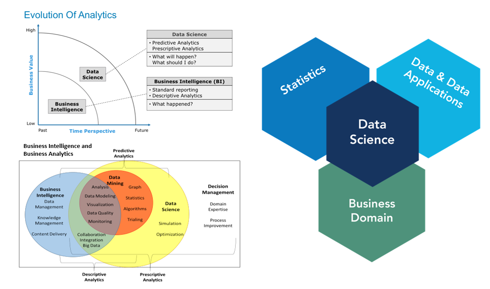

# DataScience_projects

The target with this repo is to show the evolution of the business intelligence with advanced analytics and some data science projects using CRISP-DM methodology

######  Enterprise Intelligence and Analytics

######  Methodology

