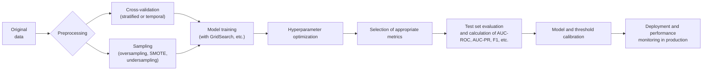

# Executive Summary

Classification models on **imbalanced data** (such as telecom churn or financial fraud) require specific metrics and procedures. Classic metrics like accuracy can be **misleading** when the majority class dominates. Instead, practitioners use Precision, Recall, F1, AUC-ROC, and AUC-PR, among others. **Precision** (TP/(TP+FP)) measures the fraction of positive predictions that are correct, and **Recall** (TP/(TP+FN)) measures the fraction of actual positives captured. **F1-score** (the harmonic mean of Precision and Recall) balances these two dimensions. **Accuracy** ((TP+TN)/Total) is intuitive, but on heavily imbalanced data it tends to look high simply by always predicting the majority class. **ROC** and **Precision-Recall (PR)** curves are used to evaluate performance across all thresholds. **AUC-ROC** (area under the ROC curve) can also be misleading in "rare-event" scenarios: even mediocre classifiers can show high AUC-ROC when the positive class is scarce. In contrast, **AUC-PR** (area under the PR curve) focuses on the rare class and is generally more informative under severe imbalance. Choosing the ideal metric depends on trade-offs: for example, if false positives are very costly, **Precision** is prioritized; if false negatives are critical (as in fraud), **Recall** is prioritized.

For **evaluation and tuning** of models, stratified cross-validation (or a time-based split when there's temporal dependency) is recommended to preserve class proportions. Balancing methods (undersampling, oversampling, SMOTE, balanced ensembles) can help, as can cost-sensitive techniques and optimal threshold selection. Custom metrics should be used when appropriate (for example, F1 or **Precision@K** for fraud detection), and probabilities should be calibrated when necessary. In production, a validation pipeline, metric monitoring, and periodic recalibration are important.

Specifically, for **churn** (moderate imbalance), metrics like F1 or AUC-ROC/PR are typically used, with light sampling and calibrated models; for **financial fraud** (extreme imbalance), the emphasis is on maximizing Recall (catching fraud) and optimizing Precision@K or expected business value. Cost matrices and clear targets (for example, contacting the top 1% highest-risk customers) help guide the model. The report below details formal definitions, interpretations, advantages and limitations of each metric, ROC vs. PR comparisons, practical strategies (sampling, validation, cost-sensitivity), and concrete recommendations for churn and fraud in telecom/financial services.

## Classic Classification Metrics

- **Accuracy**: `ACC = (TP + TN) / (TP+TN+FP+FN)`. This is the fraction of correct predictions out of the total. Intuitively, it measures the "overall hit rate." **Limitation:** On imbalanced data, accuracy can be high simply by predicting the majority class almost always. For example, with 99 non-fraud transactions and 1 fraud, a model that always predicts "non-fraud" achieves 99% accuracy but detects zero fraud. Accuracy is therefore only reasonable when classes are balanced or the costs of FP and FN are similar.

- **Precision**: `Precision = TP / (TP + FP)`. Interpretation: among the instances the model predicted as positive, what fraction are actually positive. It measures the "quality" of positive predictions. Advantage: it ignores true negatives (TN), so it isn't inflated by the majority class. Limitation: it disregards how many real positives the model failed to predict. **Precision** is used when false positives are critical (e.g., medical diagnoses where FPs lead to unnecessary treatment).

- **Recall (Sensitivity)**: `Recall = TP / (TP + FN)`. Indicates how many of the real positives were captured by the model. Advantage: also ignores TN, focusing on coverage of the positive class. Limitation: doesn't penalize false positives. **Recall** is used when false negatives are critical (e.g., detecting fraud or rare diseases).

- **F1-Score**: `F1 = 2 * (Precision * Recall) / (Precision + Recall)`. It's the harmonic mean between precision and recall. F1 summarizes into a single metric the balance between capturing positives (recall) and avoiding false positives (precision). Ideal when we want balance between the two, especially on imbalanced data. Limitation: it gives equal weight to precision and recall, which may not reflect the actual business metric.

- **Precision-Recall AUC (PR AUC)**: Area under the Precision vs. Recall curve, varying the threshold. It measures combined precision/recall performance across all thresholds. On heavily imbalanced data, PR AUC tends to be more realistic than ROC AUC. A PR AUC value close to 1 indicates an excellent balance between precision and recall across many thresholds. For rare classes, PR AUC is preferable because the baseline (precision of a random classifier) equals the fraction of the positive class, and the curve emphasizes the high-recall region.

- **ROC AUC (Area Under the ROC Curve)**: The **ROC** (Receiver Operating Characteristic) curve plots TPR (sensitivity) vs. FPR (false positive rate) across various thresholds. **AUC-ROC** is the area under that curve. Interpretation: the probability that a positive is ranked with a higher score than a negative. Value between 0 and 1; 0.5 indicates a random classifier. It's useful when classes are reasonably balanced or FP/FN costs are similar. Advantage: it considers overall performance without depending on a specific threshold. **Limitation under imbalance:** AUC-ROC can remain high even when the model captures the minority class poorly, because the FPR changes slowly when there are few possible false negatives among negatives. As Palomares (2025) puts it, the ROC curve is less sensitive to class imbalance, making it more suitable for balanced datasets. Under severe imbalance, AUC-ROC tends to overestimate real discriminative ability (for example, in a fraud dataset with <1% positives, a model might have AUC-ROC ~0.96 but a much lower PR AUC, revealing that few frauds are actually captured).

- **Balanced Accuracy**: `(TPR + TNR)/2`. Normalizes accuracy by weighting both classes equally. Indicated when we want to penalize errors in both classes equally, though this wasn't extensively covered in the cited sources.

- **ROC AUC vs. PR AUC**: In practice, for rare classes, **PR AUC** is generally more informative. ROC can give a high score even for weak classifiers (since the baseline is the diagonal line). In contrast, PR AUC emphasizes how high precision remains when high recall is achieved. Additionally, the PR curve decreases (precision drops as more recall is forced), while ROC increases (TPR rises with FPR). Generally both AUCs should be maximized, but under imbalance, **PR AUC** takes priority.

- **Other relevant metrics**: In some contexts, *Precision@K* (precision among the top-K predictions), *expected cost/savings* (based on an FP/FN cost matrix), *cost curves*, *F-beta* (a harmonic mean adjusting the importance of recall vs. precision), *Matthews Correlation Coefficient* (consistent even under imbalance), and others are used. For example, MCC (Matthews Correlation Coefficient) combines TP, TN, FP, and FN into a single formula normalized between –1 and 1. There isn't room to cover all of these, but they're worth mentioning in technical work.

## Limitations and Trade-offs on Imbalanced Data

- **Accuracy is a false friend**: As noted, a trivial classifier that always predicts the majority class will have high accuracy but fails to detect the minority class. A simple example: with 1,000 customers and 5% churn, always predicting "no churn" gives 95% accuracy while missing every churner. Accuracy therefore doesn't truly reflect performance under imbalance.

- **Precision vs. Recall (Trade-off)**: Changing the decision **threshold** moves precision and recall in opposite directions. Lowering the threshold (e.g., from 0.5 to 0.4) increases recall (captures more positives) but reduces precision (more false positives). There's always a *trade-off*: the higher the recall, the lower the precision, and vice versa. The choice depends on the relative cost of errors. As Wikipedia illustrates, in medical diagnosis a false positive costs unnecessary treatment, so high precision is preferred; in fraud detection a false negative costs financial loss, so recall is prioritized.

- **ROC vs. PR (Trade-off and Context)**: The overall ROC evaluates all thresholds but tends to smooth over errors under severe imbalance. The PR curve highlights the degradation of precision as recall increases. That's why, in "rare-class" scenarios (fraud, diagnostics, low churn), **PR AUC** should be examined closely. In scenarios where both types of errors have similar costs and classes are moderately balanced (e.g., churn ~10-20%), **AUC-ROC** can still be useful. However, even for churn, PR AUC or F1 is typically analyzed as well.

- **Threshold and Calibration**: Any probabilistic model requires choosing a classification threshold. One practice is to optimize the threshold for a metric (maximizing F1, or reaching a minimum precision). Models can also be *calibrated* (e.g., Platt scaling, isotonic regression) so that probabilities better reflect the real frequency of events. In production, the threshold is sometimes adjusted to meet business targets (e.g., flagging the top 2% of monthly risks).

- **Realistic Evaluation**: Avoid data leakage, use **stratified** validation to preserve proportions (in both churn and fraud), and if there's temporal dependency (e.g., monthly churn), use a *time-series split*. Monitor not just standard test metrics, but also business metrics such as expected cost, daily alert volume, etc.

## When to Use Each Metric (Examples and Recommendations)

- **Precision**: Use when the interest is the purity of positive predictions. Useful if each false positive generates high cost. For example, if sending a retention offer to a customer is expensive, we want high precision on predicted churners. Also useful when alert review (fraud) is expensive in terms of human effort. *Limitation:* can lead to low recall. Typical target: precision above an acceptable value (e.g., >0.3 or 30%), depending on the application.

- **Recall**: When missing positives is very costly. In fraud, failing to detect a scam directly costs money, so maximizing recall (even sacrificing precision) is normal. In churn, losing a profitable customer can cost significant revenue, so high recall on churners is desirable (ensuring they're captured), as long as precision isn't zero. Target: recall close to maximum (e.g., >80-90%), with acceptable precision.

- **F1-Score**: A good general-purpose compromise when balance between precision and recall is desired. In churn (moderate imbalance), F1 is often used as the selection metric for the final model. In fraud, F1 can be used, but with caution: F1 treats FP and FN equally.

- **AUC-ROC**: Useful for general evaluation in churn (moderate imbalance) and model comparison. Not sensitive to a fixed threshold. Typical value: values above 0.8 indicate good discrimination, but attention should be paid to class weighting. In fraud, AUC-ROC still gives an overall view, but is often high even for models that perform poorly at catching fraud.

- **AUC-PR**: Highly recommended for fraud/extreme imbalance. A PR AUC of 1.0 indicates perfection; typical values, even for good models, can be low (e.g., 0.1 to 0.5 in cases with <1% positives). The PR AUC target depends on the task: for example, in moderate churn one might aim for ~0.6–0.8; in fraud, even a PR AUC of 0.3 can be reasonable if the base rate is rare.

- **Precision@K / Recall@K**: When only the top-K cases per day/week are flagged. Example: alerting only the 100 customers with the highest churn risk each month. Measures precision among the top-K predictions. Widely used in financial fraud detection with a fixed number of investigations.

- **ROC vs. PR Curve (visual)**: When plotted, the ROC curve typically has a concave, ascending shape, while the PR curve is decreasing. The goal is to approach TPR=1 and FPR=0 on ROC, and (Precision,Recall)=(1,1) on PR. See the figure below:



## Evaluation and Tuning Strategies

- **Cross-Validation**: Use stratified *k*-fold to preserve class proportions in each fold. In churn, where seasonality exists, temporal validation can be used (e.g., train up to T and test on T+1) to avoid leakage. In fraud, data can be shuffled if it's time-independent.

- **Sampling and Balancing**: Given the imbalance, apply *undersampling* (removing majority-class examples) or *oversampling* (duplicating/generating minority-class examples). SMOTE and its variants create synthetic positive-class samples. These methods can help the model learn minority patterns. Downside: *undersampling* can lose information; *oversampling*/SMOTE can lead to overfitting if not used correctly. In fraud, extreme undersampling is sometimes undesirable (too much information lost). Alternative: use balanced ensembles, BalancedRandomForest, or let the model handle it via _class_weight_.

- **Models and Cost Functions**: Models with class-related hyperparameters or cost-sensitive loss (e.g., `class_weight='balanced'`, or XGBoost with a scale parameter) help handle imbalance. There are also cost-sensitive learning approaches, where errors on the minority class are penalized more heavily. Missing a fraud case can cost far more than a false alarm, so the cost is adjusted accordingly.

- **Custom Metrics and Threshold Optimization**: Aligning training with the final metric is crucial. For example, directly optimizing F1 or maximizing PR AUC via cross-validation. After training, adjust the threshold to hit a target (e.g., minimum Recall). Bayesian optimization can even be used to find the best threshold according to the business metric.

- **Automated Pipelines and Monitoring**: Building a pipeline (preprocessing + model + post-calibration) and integrating validators enables reproducibility. In production, monitor score distribution, the proportion of positives, and recalibrate the model/performance (retrain) as data shifts.

## Recommendations for Churn (Telecom) vs. Financial Fraud Detection

| Aspect            | Churn (moderate imbalance) | Financial Fraud (extreme imbalance) |
|--------------------|----------------------------------|----------------------------------------------|
| **Goals/Metrics** | F1 or AUC-ROC and AUC-PR. Business metrics: *confirmed retention*, retained contract value. Typical target: F1 >30–50%, AUC-ROC >0.8, AUC-PR ~0.5–0.7. | High Recall (e.g., >90%) at the cost of lower precision; PR AUC as the key metric. Business metrics: expected value saved (e.g., $ saved), precision@top-K. Target: detect most fraud (high Recall) while maintaining a minimally viable precision (e.g., >5–10%). |
| **Sampling**      | Light oversampling if needed (SMOTE), or weight adjustment. Undersampling isn't as critical, since imbalance is moderate. | Combination of strong undersampling (of normal transactions) and oversampling/SMOTE of fraud cases. Use *ensembles* (balanced Random Forest, XGBoost with `scale_pos_weight`). Watch for leakage: separate train/test before sampling. |
| **Models & Losses**| Linear models and trees are viable (LogReg, RandomForest, GBM). Adjust class_weight or a cost parameter. F1-logloss or AUC used in tuning. | Beyond classic models, try anomaly detection techniques (Isolation Forest) and Bayesian networks. Cost-sensitive loss functions (weighted loss) are essential. Complex models (XGBoost, LightGBM) tend to perform better. |
| **Threshold & Calibration**| Adjust the threshold (e.g., predict churners only if P>limit) to balance the cost of retention actions. Calibrate probabilities to reflect real risk. | Set the threshold to operate at the desired point on the PR curve (e.g., focus on the top 1–5% of scores). The standard 0.5 threshold is often not used. Use calibration (Platt, isotonic) so the score reflects the real probability of fraud, facilitating automated decisions. |
| **Cost/Business**  | Use a cost matrix: e.g., cost of offering a discount vs. retained revenue. Evaluate *Expected Lift* (percentage savings). A balanced scorecard includes the retained customer's *Lifetime Value*. | Define the cost of investigating a false positive vs. the average cost of undetected fraud. Business metric: *Expected Value* (value saved = detected gain − alert cost). Focus on high precision@K or direct cost-benefit. |

## Comparative Table of Metrics and Strategies

| Metric/Strategy         | When to use (cases)                           | Advantages                                       | Limitations                                          | Example target values*        |
|----------------------------|-----------------------------------------------|-------------------------------------------------|-------------------------------------------------------|--------------------------------|
| **Accuracy**               | Balanced data, low FP/FN costs     | Easy to interpret                           | Misleading if imbalanced (may ignore minority class)  | >80-90% (on near-balanced data) |
| **Precision**              | Costly FPs (spam, diagnostics)             | Focuses on predicted positives             | Ignores recall; high precision may mean low recall | >30-50% (varies by domain)     |
| **Recall (Sensitivity)** | Costly FNs (fraud, rare disease)             | Ensures coverage of the positive class           | Can generate many FPs; doesn't inform precision       | >80-90% (when FN is very severe)|
| **F1-Score**               | Balancing precision & recall                 | Useful under imbalance; single metric            | Weighs precision/recall equally; doesn't adapt to cost| >0.4-0.6 (churn); >0.2 (fraud)  |
| **AUC-ROC**                | General evaluation, ~balanced classes        | Threshold-independent, understandable          | Overestimates under strong imbalance | >0.8 (good); 0.5 (random)       |
| **AUC-PR**                 | Rare positive class (fraud, low churn)    | Focuses on the rare class; sensitive to real performance | Can be low (hard to be high for rare classes) | >0.5 (moderate churn); >0.1 (fraud) |
| **Precision@K / Alerts**  | Limited-alert scenarios (fraud, churn) | Focuses on top-k cases, aligned with operations      | Depends on choosing K; doesn't capture the full trade-off | Precision@1% >5% (fraud)       |
| **Balanced Accuracy**      | Imbalanced classes (equal weighting)           | Weighs TPR and TNR equally                  | Not common in business analyses                | ~0.5-0.7 (variable)             |
| **Sampling (SMOTE etc.)**  | Training on imbalanced data           | Can improve minority-class learning              | Can overfit/introduce noise; may lose TN with undersampling | –                              |
| **Stratified Validation**| Always used in binary classification             | Preserves class proportions across folds          | Doesn't apply to time series                    | –                              |
| **Time-series Split**      | Time-dependent data (monthly churn)    | Prevents temporal leakage; simulates production     | Reduces training data; imbalance varies by window | –                              |
| **Cost-sensitive / Loss**  | When error costs differ substantially       | Steers the model toward the costlier error type | Hard to quantify real costs                | –                              |
| **Threshold Tuning**       | Adjusting trade-offs post-training                 | Optimizes the target metric (F1, fixed recall, etc.)      | Based on validation (can overfit)      | –                              |
| **Monitoring/Deployment**   | Models in production                          | Captures drift, enables recalibration/maintenance             | Requires monitoring infrastructure        | –                              |

*Target values are illustrative and depend on the business and the specific dataset.

## ROC vs. PR Curves (Illustrative Example)

Below is a schematic example comparing ROC and Precision-Recall curves in a case of strong imbalance. The ROC curve (blue) tends to pass close to the top point (1,1), giving a high AUC, while the PR curve (orange) shows that precision drops quickly as recall increases for rare classes:

```
ROC Curve (TPR vs FPR) and PR (Precision vs Recall):

 (0,1)|
      |   •
TPR=1|      •
      |      •   ROC (TPR vs FPR, rising toward TPR=1, FPR=0)
      |   • 
      +------------------
       FPR

Precision
   1 |•
     |• PR Curve
     |  Precision vs Recall, starting at high precision for low recall
     |    •
   0 |___•______Recall
       0      1
```

As a result, even a mediocre model on extreme data can have a high ROC AUC (because the FPR changes little), but a low PR AUC (due to the drop in precision). That's why **PR AUC** is frequently recommended for rare classes.

## Conclusion

In summary, evaluating models on imbalanced data requires care: use metrics focused on the minority class (Precision, Recall, F1, AUC-PR) and choose according to the cost of errors. Experimental design (validation, sampling) and subsequent calibration are just as important as the algorithm itself. For churn, aim for calibrated models with good F1 or AUC (with light oversampling); for fraud, maximize recall and use alert-based techniques (Precision@K, expected value). Decisions should always reflect business impact (e.g., loss avoided vs. cost of action).

**Sources:** Classifier evaluation documentation and literature, including practical articles and tutorials (e.g., Wiggers 2022, Palomares 2025, MachineLearningMastery, Wikipedia).
